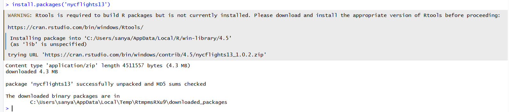

# Практическая работа 003
IT-life1@yandex.ru

## Цель работы

1.  Отработать навыки анализа реальных данных с помощью языка R  
2.  Закрепить понимание структуры табличных данных и их взаимосвязей  
3.  Научиться эффективно применять функции пакета `dplyr` (`select()`,
    `filter()`, `mutate()`, `arrange()`, `group_by()`) для решения
    практических задач

## Исходные данные

1.  Операционная система: Windows 10
2.  Среда разработки: RStudio Desktop  
3.  Версия R: 4.5.1

## Задание

С использованием пакета `nycflights13` и инструментов `dplyr` провести
анализ авиационных данных за 2013 год и ответить на серию аналитических
вопросов.

## Ход работы

1.  Выполнить установку пакета `nycflights13`.

2.  Провести анализ встроенных в пакет `nycflights13` наборов данных с
    использованием языка R и ответить на вопросы:

    1.  Сколько встроенных в пакет nycflights13 датафреймов?  
    2.  Сколько строк в каждом датафрейме?  
    3.  Сколько столбцов в каждом датафрейме?  
    4.  Как просмотреть примерный вид датафрейма?  
    5.  Сколько компаний-перевозчиков (carrier) учитывают эти наборы
        данных (представлено в наборах данных)?  
    6.  Сколько рейсов принял аэропорт John F Kennedy Intl в мае?  
    7.  Какой самый северный аэропорт?  
    8.  Какой аэропорт самый высокогорный (находится выше всех над
        уровнем моря)?  
    9.  Какие бортовые номера у самых старых самолетов?  
    10. Какая средняя температура воздуха была в сентябре в аэропорту
        John FKennedy Intl (в градусах Цельсия)?  
    11. Самолеты какой авиакомпании совершили больше всего вылетов в
        июне?  
    12. Самолеты какой авиакомпании задерживались чаще других в 2013
        году?

3.  Подготовить отчёт в соответствии с заданным шаблоном.

### Шаг 1

Установка пакета `nycflights13`:



### Шаг 2

Подключим необходимые библиотеки

``` r
library(nycflights13)
```

``` r
library(dplyr)
```


    Attaching package: 'dplyr'

    The following objects are masked from 'package:stats':

        filter, lag

    The following objects are masked from 'package:base':

        intersect, setdiff, setequal, union

#### Сколько встроенных в пакет nycflights13 датафреймов?

``` r
data(package = "nycflights13")$results[, "Item"] %>% length()
```

    [1] 5

#### Сколько строк в каждом датафрейме?

``` r
sapply(list(flights, weather, planes, airports, airlines), nrow)
```

    [1] 336776  26115   3322   1458     16

#### Сколько столбцов в каждом датафрейме?

``` r
ncol(flights)
```

    [1] 19

``` r
ncol(weather)
```

    [1] 15

``` r
ncol(planes)
```

    [1] 9

``` r
ncol(airports)
```

    [1] 8

``` r
ncol(airlines)
```

    [1] 2

#### Как просмотреть примерный вид датафрейма?

``` r
flights %>% glimpse()
```

    Rows: 336,776
    Columns: 19
    $ year           <int> 2013, 2013, 2013, 2013, 2013, 2013, 2013, 2013, 2013, 2…
    $ month          <int> 1, 1, 1, 1, 1, 1, 1, 1, 1, 1, 1, 1, 1, 1, 1, 1, 1, 1, 1…
    $ day            <int> 1, 1, 1, 1, 1, 1, 1, 1, 1, 1, 1, 1, 1, 1, 1, 1, 1, 1, 1…
    $ dep_time       <int> 517, 533, 542, 544, 554, 554, 555, 557, 557, 558, 558, …
    $ sched_dep_time <int> 515, 529, 540, 545, 600, 558, 600, 600, 600, 600, 600, …
    $ dep_delay      <dbl> 2, 4, 2, -1, -6, -4, -5, -3, -3, -2, -2, -2, -2, -2, -1…
    $ arr_time       <int> 830, 850, 923, 1004, 812, 740, 913, 709, 838, 753, 849,…
    $ sched_arr_time <int> 819, 830, 850, 1022, 837, 728, 854, 723, 846, 745, 851,…
    $ arr_delay      <dbl> 11, 20, 33, -18, -25, 12, 19, -14, -8, 8, -2, -3, 7, -1…
    $ carrier        <chr> "UA", "UA", "AA", "B6", "DL", "UA", "B6", "EV", "B6", "…
    $ flight         <int> 1545, 1714, 1141, 725, 461, 1696, 507, 5708, 79, 301, 4…
    $ tailnum        <chr> "N14228", "N24211", "N619AA", "N804JB", "N668DN", "N394…
    $ origin         <chr> "EWR", "LGA", "JFK", "JFK", "LGA", "EWR", "EWR", "LGA",…
    $ dest           <chr> "IAH", "IAH", "MIA", "BQN", "ATL", "ORD", "FLL", "IAD",…
    $ air_time       <dbl> 227, 227, 160, 183, 116, 150, 158, 53, 140, 138, 149, 1…
    $ distance       <dbl> 1400, 1416, 1089, 1576, 762, 719, 1065, 229, 944, 733, …
    $ hour           <dbl> 5, 5, 5, 5, 6, 5, 6, 6, 6, 6, 6, 6, 6, 6, 6, 5, 6, 6, 6…
    $ minute         <dbl> 15, 29, 40, 45, 0, 58, 0, 0, 0, 0, 0, 0, 0, 0, 0, 59, 0…
    $ time_hour      <dttm> 2013-01-01 05:00:00, 2013-01-01 05:00:00, 2013-01-01 0…

``` r
weather %>% glimpse()
```

    Rows: 26,115
    Columns: 15
    $ origin     <chr> "EWR", "EWR", "EWR", "EWR", "EWR", "EWR", "EWR", "EWR", "EW…
    $ year       <int> 2013, 2013, 2013, 2013, 2013, 2013, 2013, 2013, 2013, 2013,…
    $ month      <int> 1, 1, 1, 1, 1, 1, 1, 1, 1, 1, 1, 1, 1, 1, 1, 1, 1, 1, 1, 1,…
    $ day        <int> 1, 1, 1, 1, 1, 1, 1, 1, 1, 1, 1, 1, 1, 1, 1, 1, 1, 1, 1, 1,…
    $ hour       <int> 1, 2, 3, 4, 5, 6, 7, 8, 9, 10, 11, 13, 14, 15, 16, 17, 18, …
    $ temp       <dbl> 39.02, 39.02, 39.02, 39.92, 39.02, 37.94, 39.02, 39.92, 39.…
    $ dewp       <dbl> 26.06, 26.96, 28.04, 28.04, 28.04, 28.04, 28.04, 28.04, 28.…
    $ humid      <dbl> 59.37, 61.63, 64.43, 62.21, 64.43, 67.21, 64.43, 62.21, 62.…
    $ wind_dir   <dbl> 270, 250, 240, 250, 260, 240, 240, 250, 260, 260, 260, 330,…
    $ wind_speed <dbl> 10.35702, 8.05546, 11.50780, 12.65858, 12.65858, 11.50780, …
    $ wind_gust  <dbl> NA, NA, NA, NA, NA, NA, NA, NA, NA, NA, NA, NA, NA, NA, 20.…
    $ precip     <dbl> 0, 0, 0, 0, 0, 0, 0, 0, 0, 0, 0, 0, 0, 0, 0, 0, 0, 0, 0, 0,…
    $ pressure   <dbl> 1012.0, 1012.3, 1012.5, 1012.2, 1011.9, 1012.4, 1012.2, 101…
    $ visib      <dbl> 10, 10, 10, 10, 10, 10, 10, 10, 10, 10, 10, 10, 10, 10, 10,…
    $ time_hour  <dttm> 2013-01-01 01:00:00, 2013-01-01 02:00:00, 2013-01-01 03:00…

``` r
planes %>% glimpse()
```

    Rows: 3,322
    Columns: 9
    $ tailnum      <chr> "N10156", "N102UW", "N103US", "N104UW", "N10575", "N105UW…
    $ year         <int> 2004, 1998, 1999, 1999, 2002, 1999, 1999, 1999, 1999, 199…
    $ type         <chr> "Fixed wing multi engine", "Fixed wing multi engine", "Fi…
    $ manufacturer <chr> "EMBRAER", "AIRBUS INDUSTRIE", "AIRBUS INDUSTRIE", "AIRBU…
    $ model        <chr> "EMB-145XR", "A320-214", "A320-214", "A320-214", "EMB-145…
    $ engines      <int> 2, 2, 2, 2, 2, 2, 2, 2, 2, 2, 2, 2, 2, 2, 2, 2, 2, 2, 2, …
    $ seats        <int> 55, 182, 182, 182, 55, 182, 182, 182, 182, 182, 55, 55, 5…
    $ speed        <int> NA, NA, NA, NA, NA, NA, NA, NA, NA, NA, NA, NA, NA, NA, N…
    $ engine       <chr> "Turbo-fan", "Turbo-fan", "Turbo-fan", "Turbo-fan", "Turb…

``` r
airports %>% glimpse()
```

    Rows: 1,458
    Columns: 8
    $ faa   <chr> "04G", "06A", "06C", "06N", "09J", "0A9", "0G6", "0G7", "0P2", "…
    $ name  <chr> "Lansdowne Airport", "Moton Field Municipal Airport", "Schaumbur…
    $ lat   <dbl> 41.13047, 32.46057, 41.98934, 41.43191, 31.07447, 36.37122, 41.4…
    $ lon   <dbl> -80.61958, -85.68003, -88.10124, -74.39156, -81.42778, -82.17342…
    $ alt   <dbl> 1044, 264, 801, 523, 11, 1593, 730, 492, 1000, 108, 409, 875, 10…
    $ tz    <dbl> -5, -6, -6, -5, -5, -5, -5, -5, -5, -8, -5, -6, -5, -5, -5, -5, …
    $ dst   <chr> "A", "A", "A", "A", "A", "A", "A", "A", "U", "A", "A", "U", "A",…
    $ tzone <chr> "America/New_York", "America/Chicago", "America/Chicago", "Ameri…

``` r
airlines %>% glimpse()
```

    Rows: 16
    Columns: 2
    $ carrier <chr> "9E", "AA", "AS", "B6", "DL", "EV", "F9", "FL", "HA", "MQ", "O…
    $ name    <chr> "Endeavor Air Inc.", "American Airlines Inc.", "Alaska Airline…

#### Сколько компаний-перевозчиков (carrier) учитывают эти наборы данных (представлено в наборах данных)?

``` r
airlines %>% select(carrier) %>% n_distinct()
```

    [1] 16

#### Сколько рейсов принял аэропорт John F Kennedy Intl в мае?

``` r
flights %>%
  filter(origin == "JFK", month == 5) %>%
  nrow()
```

    [1] 9397

#### Какой самый северный аэропорт?

``` r
airports %>%
  filter(!is.na(lat)) %>%
  slice_max(lat, n = 1) %>%
  pull(name)
```

    [1] "Dillant Hopkins Airport"

#### Какой аэропорт самый высокогорный (находится выше всех над уровнем моря)?

``` r
airports %>%
  filter(!is.na(alt)) %>%
  slice_max(alt, n = 1) %>%
  pull(name)
```

    [1] "Telluride"

#### Какие бортовые номера у самых старых самолетов?

``` r
planes %>%
  filter(!is.na(year)) %>%
  arrange(year) %>%
  head(6) %>%
  select(tailnum) %>%
  knitr::kable(format = "markdown")
```

<table>
<thead>
<tr>
<th style="text-align: left;">tailnum</th>
</tr>
</thead>
<tbody>
<tr>
<td style="text-align: left;">N381AA</td>
</tr>
<tr>
<td style="text-align: left;">N201AA</td>
</tr>
<tr>
<td style="text-align: left;">N567AA</td>
</tr>
<tr>
<td style="text-align: left;">N378AA</td>
</tr>
<tr>
<td style="text-align: left;">N575AA</td>
</tr>
<tr>
<td style="text-align: left;">N14629</td>
</tr>
</tbody>
</table>

#### Какая средняя температура воздуха была в сентябре в аэропорту John F Kennedy Intl (в градусах Цельсия).

``` r
weather %>%
  filter(origin == "JFK", month == 9) %>%
  summarise(avg_temp_F = mean(temp, na.rm = TRUE)) %>%
  mutate(avg_temp_C = (avg_temp_F - 32) * 5 / 9) %>%
  pull(avg_temp_C)
```

    [1] 19.38764

#### Самолеты какой авиакомпании совершили больше всего вылетов в июне?

``` r
flights %>%
  filter(month == 6) %>%
  count(carrier, sort = TRUE) %>%
  left_join(airlines, by = "carrier") %>%
  slice(1) %>%
  pull(name)
```

    [1] "United Air Lines Inc."

#### Самолеты какой авиакомпании задерживались чаще других в 2013 году?

``` r
flights %>%
  filter(arr_delay > 0, year == 2013) %>%
  count(carrier, sort = TRUE) %>%
  left_join(airlines, by = "carrier") %>%
  slice(1) %>%
  pull(name)
```

    [1] "ExpressJet Airlines Inc."

### Шаг 3

Отчёт подготовлен и оформлен в соответствии с требованиями. Все задачи
выполнены с использованием современных практик анализа данных в R.
