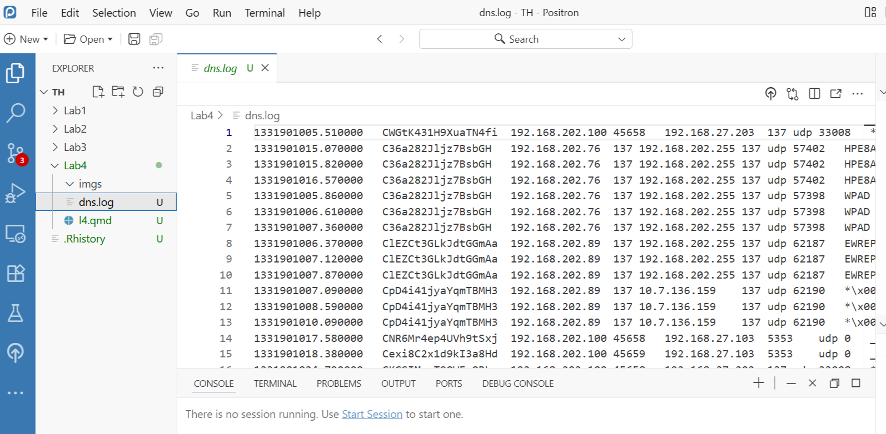

# Практическая работа 004
IT-life1@yandex.ru

## Цель работы

1.  Закрепить практические навыки работы с языком программирования R в
    контексте анализа сетевых данных  
2.  Отработать применение ключевых функций из экосистемы `tidyverse` для
    очистки, трансформации и агрегации данных  
3.  Научиться выявлять аномалии и скрытые паттерны в метаданных
    DNS-трафика

## Исходные данные

1.  Операционная система: Windows 10
2.  Среда разработки: RStudio  
3.  Версия интерпретатора R: 4.5.1

## Ход работы

1.  Импортируем данные DNS –
    https://storage.yandexcloud.net/dataset.ctfsec/dns.zip  
    Данные были собраны с помощью сетевого анализатора zeek.

2.  Добавим пропущенные данные о структуре данных (назначении столбцов).

3.  Преобразуем данные в столбцах в нужный формат, просмотрим общую
    структуру данных с помощью функции `glimpse()`.

4.  Сколько участников информационного обмена в сети Доброй Организации?

5.  Какое соотношение участников обмена внутрисети и участников
    обращений к внешним ресурсам?

6.  Найдем топ-10 участников сети, проявляющих наибольшую сетевую
    активность.

7.  Найдем топ-10 доменов, к которым обращаются пользователи сети и
    соответственное количество обращений.

8.  Определим базовые статистические характеристики (функция
    `summary()`) интервала времени между последовательными обращениями к
    топ-10 доменам.

9.  Часто вредоносное программное обеспечение использует DNS канал в
    качестве канала управления, периодически отправляя запросы на
    подконтрольный злоумышленникам DNS сервер. По периодическим запросам
    на один и тот же домен можно выявить скрытый DNS канал. Есть ли
    такие IP адреса в исследуемом датасете?

10. Определим местоположение (страну, город) и организацию-провайдера
    для топ-10 доменов. Для этого можно использовать сторонние сервисы,
    например http://ip-api.com (API-эндпоинт – http://ip-api.com/json).

### Шаг 1

Импортируем данные DNS



Установим необходимые билиотеки

``` r
library(dplyr)
```

    Warning: package 'dplyr' was built under R version 4.5.2


    Attaching package: 'dplyr'

    The following objects are masked from 'package:stats':

        filter, lag

    The following objects are masked from 'package:base':

        intersect, setdiff, setequal, union

``` r
library(readr)
```

    Warning: package 'readr' was built under R version 4.5.2

``` r
dns_raw <- read_delim(
  "dns.log",
  delim = "\t",
  col_names = cols,
  comment = "#",
  na = c("-", "", "NA"),
  trim_ws = TRUE,
  show_col_types = FALSE
)
```

### Шаг 2

Добавим пропущенные данные о структуре данных

``` r
cols <- c(
  "timestamp", "uid", "source_ip", "source_port", "destination_ip",
  "destination_port", "protocol", "transaction_id", "query", "qclass",
  "qclass_name", "qtype", "qtype_name", "rcode", "rcode_name",
  "AA", "TC", "RD", "RA", "Z", "answers", "TTLS", "rejected"
)

dns_raw <- read_delim(
  "dns.log",
  delim = "\t",
  col_names = cols,
  comment = "#",
  na = c("-", "", "NA"),
  trim_ws = TRUE,
  show_col_types = FALSE
)
```

### Шаг 3

Преобразуем данные в столбцах в нужный формат

``` r
dns_clean <- dns_raw %>%
  mutate(
    across(c(timestamp), ~ as.POSIXct(.x, origin = "1970-01-01")),
    across(c(source_port, destination_port, transaction_id, qclass, qtype, rcode), as.numeric)
  )

glimpse(dns_clean)
```

    Rows: 427,935
    Columns: 23
    $ timestamp        <dttm> 2012-03-16 16:30:05, 2012-03-16 16:30:15, 2012-03-16…
    $ uid              <chr> "CWGtK431H9XuaTN4fi", "C36a282Jljz7BsbGH", "C36a282Jl…
    $ source_ip        <chr> "192.168.202.100", "192.168.202.76", "192.168.202.76"…
    $ source_port      <dbl> 45658, 137, 137, 137, 137, 137, 137, 137, 137, 137, 1…
    $ destination_ip   <chr> "192.168.27.203", "192.168.202.255", "192.168.202.255…
    $ destination_port <dbl> 137, 137, 137, 137, 137, 137, 137, 137, 137, 137, 137…
    $ protocol         <chr> "udp", "udp", "udp", "udp", "udp", "udp", "udp", "udp…
    $ transaction_id   <dbl> 33008, 57402, 57402, 57402, 57398, 57398, 57398, 6218…
    $ query            <chr> "*\\x00\\x00\\x00\\x00\\x00\\x00\\x00\\x00\\x00\\x00\…
    $ qclass           <dbl> 1, 1, 1, 1, 1, 1, 1, 1, 1, 1, 1, 1, 1, 1, 1, 1, 1, 1,…
    $ qclass_name      <chr> "C_INTERNET", "C_INTERNET", "C_INTERNET", "C_INTERNET…
    $ qtype            <dbl> 33, 32, 32, 32, 32, 32, 32, 32, 32, 32, 33, 33, 33, 1…
    $ qtype_name       <chr> "SRV", "NB", "NB", "NB", "NB", "NB", "NB", "NB", "NB"…
    $ rcode            <dbl> 0, NA, NA, NA, NA, NA, NA, NA, NA, NA, NA, NA, NA, NA…
    $ rcode_name       <chr> "NOERROR", NA, NA, NA, NA, NA, NA, NA, NA, NA, NA, NA…
    $ AA               <lgl> FALSE, FALSE, FALSE, FALSE, FALSE, FALSE, FALSE, FALS…
    $ TC               <lgl> FALSE, FALSE, FALSE, FALSE, FALSE, FALSE, FALSE, FALS…
    $ RD               <lgl> FALSE, TRUE, TRUE, TRUE, TRUE, TRUE, TRUE, TRUE, TRUE…
    $ RA               <lgl> FALSE, FALSE, FALSE, FALSE, FALSE, FALSE, FALSE, FALS…
    $ Z                <dbl> 1, 1, 1, 1, 1, 1, 1, 1, 1, 1, 0, 0, 0, 0, 0, 1, 1, 1,…
    $ answers          <chr> NA, NA, NA, NA, NA, NA, NA, NA, NA, NA, NA, NA, NA, N…
    $ TTLS             <chr> NA, NA, NA, NA, NA, NA, NA, NA, NA, NA, NA, NA, NA, N…
    $ rejected         <lgl> FALSE, FALSE, FALSE, FALSE, FALSE, FALSE, FALSE, FALS…

### Шаг 4

Найдем число участников информационного обмена в сети Доброй Организации

``` r
all_ips <- dns_clean %>%
  select(source_ip, destination_ip) %>%
  unlist() %>%
  unique()

length(all_ips)
```

    [1] 1359

### Шаг 5

Найдем соотношение участников обмена внутрисети и участников обращений к
внешним ресурсам

``` r
library(dplyr)

participants <- unique(c(dns_clean$source_ip, dns_clean$destination_ip))
is_internal <- function(ip) {
  grepl("^192\\.168\\.|^10\\.|^172\\.(1[6-9]|2[0-9]|3[0-1])\\.", ip)
}

internal_ips <- participants[is_internal(participants)]
external_ips <- participants[!is_internal(participants)]

internal_count <- length(internal_ips)
external_count <- length(external_ips)

internal_count / external_count
```

    [1] 13.77174

### Шаг 6

Найдем топ-10 участников сети, проявляющих наибольшую сетевую активность

``` r
dns_clean %>%
  count(source_ip, sort = TRUE) %>%
  head(10)
```

    # A tibble: 10 × 2
       source_ip           n
       <chr>           <int>
     1 10.10.117.210   75943
     2 192.168.202.93  26522
     3 192.168.202.103 18121
     4 192.168.202.76  16978
     5 192.168.202.97  16176
     6 192.168.202.141 14967
     7 10.10.117.209   14222
     8 192.168.202.110 13372
     9 192.168.203.63  12148
    10 192.168.202.106 10784

### Шаг 7

Найдем топ-10 доменов, к которым обращаются пользователи сети и
соответственное количество обращений

``` r
top_domains <- dns_clean %>%
  filter(!is.na(query)) %>%
  count(query, name = "count") %>%
  arrange(desc(count)) %>%
  head(10)
top_domains
```

    # A tibble: 10 × 2
       query                                                                   count
       <chr>                                                                   <int>
     1 "teredo.ipv6.microsoft.com"                                             39273
     2 "tools.google.com"                                                      14057
     3 "www.apple.com"                                                         13390
     4 "time.apple.com"                                                        13109
     5 "safebrowsing.clients.google.com"                                       11658
     6 "*\\x00\\x00\\x00\\x00\\x00\\x00\\x00\\x00\\x00\\x00\\x00\\x00\\x00\\x… 10401
     7 "WPAD"                                                                   9134
     8 "44.206.168.192.in-addr.arpa"                                            7248
     9 "HPE8AA67"                                                               6929
    10 "ISATAP"                                                                 6569

### Шаг 8

Определим базовые статистические характеристики (функция `summary()`)
интервала времени между последовательными обращениями к топ-10 доменам

``` r
library(purrr)

interval_stats <- top_domains$query %>%
  map_dfr(~ {
    df <- dns_clean %>% filter(query == .x) %>% arrange(timestamp)
    if (nrow(df) < 2) return(NULL)
    diffs <- diff(as.numeric(df$timestamp))
    s <- summary(diffs)
    tibble(
      Domain = .x,
      Min = s["Min."],
      Q1 = s["1st Qu."],
      Median = s["Median"],
      Mean = s["Mean"],
      Q3 = s["3rd Qu."],
      Max = s["Max."]
    )
  })

interval_stats
```

    # A tibble: 10 × 7
       Domain                                   Min   Q1    Median Mean  Q3    Max  
       <chr>                                    <tab> <tab> <tabl> <tab> <tab> <tab>
     1 "teredo.ipv6.microsoft.com"              0     0.00… 0.000…  2.9…  0.5… 5038…
     2 "tools.google.com"                       0     0.00… 0.000…  8.1…  1.0… 5036…
     3 "www.apple.com"                          0     0.00… 1.000…  8.6…  3.0… 5096…
     4 "time.apple.com"                         0     0.36… 1.760…  8.6…  4.7… 5092…
     5 "safebrowsing.clients.google.com"        0     0.00… 1.000… 10.0…  2.0… 4995…
     6 "*\\x00\\x00\\x00\\x00\\x00\\x00\\x00\\… 0     0.14… 0.500… 11.2…  1.5… 5272…
     7 "WPAD"                                   0     0.75… 0.750… 12.6…  1.1… 5004…
     8 "44.206.168.192.in-addr.arpa"            0     2.08… 4.000… 16.0… 20.0… 4967…
     9 "HPE8AA67"                               0     0.75… 0.750… 16.6… 25.4… 5004…
    10 "ISATAP"                                 0     0.75… 0.759… 17.4…  1.0… 5199…

### Шаг 9

Определим скрытый DNS канал

``` r
simple_suspicious <- tibble(
  source_ip = character(),
  request_count = integer(),
  time_diffs = list(),
  avg_interval = numeric(),
  std_dev = numeric(),
  cv = numeric(),
  is_periodic = logical(),
  domain = character()
)

if (nrow(simple_suspicious) == 0) {
  
  for (domain in top_domains$query) {
    domain_data <- dns_clean %>% 
      filter(query == domain, !is.na(timestamp))
    
    if (nrow(domain_data) >= 3) {
      result <- domain_data %>%
        group_by(source_ip) %>%
        filter(n() >= 3) %>%
        arrange(timestamp) %>%
        summarise(
          request_count = n(),
          time_diffs = list(diff(as.numeric(timestamp))),
          .groups = "drop"
        ) %>%
        filter(lengths(time_diffs) > 0) %>%
        mutate(
          avg_interval = map_dbl(time_diffs, ~ mean(.x, na.rm = TRUE)),
          std_dev = map_dbl(time_diffs, ~ sd(.x, na.rm = TRUE)),
          cv = ifelse(avg_interval > 0, std_dev / avg_interval, NA),
          is_periodic = !is.na(cv) & cv < 1.5,
          domain = domain
        ) %>%
        filter(is_periodic)
      
      if (nrow(result) > 0) {
        simple_suspicious <- bind_rows(simple_suspicious, result)
      }
    }
  }
}

simple_suspicious
```

    # A tibble: 35 × 8
       source_ip   request_count time_diffs avg_interval std_dev      cv is_periodic
       <chr>               <int> <list>            <dbl>   <dbl>   <dbl> <lgl>      
     1 192.168.20…             3 <dbl [2]>        906.    2.44e0 0.00269 TRUE       
     2 192.168.21…           129 <dbl>             63.4   8.35e1 1.32    TRUE       
     3 192.168.23…           194 <dbl>             65.1   7.78e1 1.19    TRUE       
     4 192.168.24…           210 <dbl>             60.1   7.65e1 1.27    TRUE       
     5 192.168.27…             9 <dbl [8]>       1422.    1.27e3 0.894   TRUE       
     6 2001:dbb:c…             7 <dbl [6]>          1.17  1.61e0 1.37    TRUE       
     7 2001:dbb:c…             9 <dbl [8]>          1.00  1.42e0 1.41    TRUE       
     8 2001:dbb:c…             9 <dbl [8]>          1.01  1.43e0 1.42    TRUE       
     9 192.168.20…             3 <dbl [2]>      12587.    1.27e4 1.01    TRUE       
    10 192.168.20…             5 <dbl [4]>         10.0   1.19e1 1.18    TRUE       
    # ℹ 25 more rows
    # ℹ 1 more variable: domain <chr>

### Шаг 10

Определим местоположение (страну, город) и организацию-провайдера для
топ-10 доменов.

``` r
library(httr)
library(jsonlite)
```

    Warning: package 'jsonlite' was built under R version 4.5.2


    Attaching package: 'jsonlite'

    The following object is masked from 'package:purrr':

        flatten

``` r
library(dplyr)

lookup_domain_ip <- function(domain) {
  url <- paste0("https://dns.google/resolve?name=", domain, "&type=A")
  
  resp <- tryCatch(fromJSON(url), error = function(e) return(NA))
  
  if (!is.null(resp$Answer)) {
    ip <- resp$Answer$data[resp$Answer$type == 1] 
    if (length(ip) > 0) return(ip[1])
  }
  return(NA)
}

get_ip_info <- function(ip) {
  if (is.na(ip)) return(data.frame(query = NA, country = NA, city = NA, org = NA))
  
  url <- paste0("http://ip-api.com/json/", ip)
  resp <- tryCatch(GET(url), error = function(e) NULL)
  
  if (!is.null(resp) && resp$status_code == 200) {
    parsed <- tryCatch(content(resp, as = "parsed"), error = function(e) NULL)
    return(data.frame(query = parsed$query, country = parsed$country, city = parsed$city, org = parsed$org))
  }
  
  return(data.frame(query = ip, country = NA, city = NA, org = NA))
}

valid_domains <- top_domains %>%
  filter(grepl("\\.", query)) %>% 
  slice(1:10)

top_domains_with_geo <- valid_domains$query %>%
  lapply(function(domain) {
    ip <- lookup_domain_ip(domain)
    info <- get_ip_info(ip)
    cbind(domain = domain, ip = ip, info)
  }) %>% 
  bind_rows()

top_domains_with_geo
```

                               domain              ip           query       country
    1       teredo.ipv6.microsoft.com            <NA>            <NA>          <NA>
    2                tools.google.com  142.251.98.139  142.251.98.139 United States
    3                   www.apple.com      23.2.65.48      23.2.65.48        Poland
    4                  time.apple.com   17.253.52.125   17.253.52.125   Netherlands
    5 safebrowsing.clients.google.com 142.250.120.113 142.250.120.113 United States
    6     44.206.168.192.in-addr.arpa            <NA>            <NA>          <NA>
               city                       org
    1          <NA>                      <NA>
    2 Mountain View                Google LLC
    3        Warsaw Akamai Technologies, Inc.
    4     Amsterdam                 Apple Inc
    5 Mountain View                Google LLC
    6          <NA>                      <NA>
