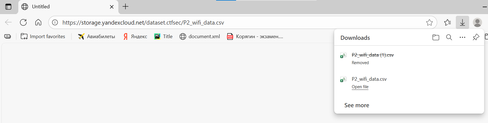

# Практическая работа 005
IT-life1@yandex.ru

# Исследование информации о состоянии беспроводных сетей

## Цель работы

1.  Получить знания о методах исследования радиоэлектронной обстановки.
2.  Составить представление о механизмах работы Wi-Fi сетей на канальном
    и сетевом уровне модели OSI.
3.  Зекрепить практические навыки использования языка программирования R
    для обработки данных
4.  Закрепить знания основных функций обработки данных экосистемы
    tidyverse языка R

## Исходные данные

1.  Операционная система: Windows 10
2.  Среда разработки: RStudio
3.  Версия интерпретатора R: 4.5.1

## Ход работы

1.  Импортируем данные wifi –
    https://storage.yandexcloud.net/dataset.ctfsec/P2_wifi_data.csv и
    https://github.com/AutomationNetTech/Vendor-OUI-MongoDB-Collection/blob/main/vendor_oui_id_is_oui_prefix.json;
    подготовим данные для дальнейшего анализа.

2.  Проведем анализ датасета с точками доступа: 2.1 Определить
    небезопасные точки доступа (без шифрования – OPN) 2.2 Определить
    производителя для каждого обнаруженного устройства 2.3 Выявить
    устройства, использующие последнюю версию протокола шифрования WPA3,
    и названия точек доступа, реализованных на этих устройствах 2.4
    Отсортировать точки доступа по интервалу времени, в течение которого
    они находились на связи, по убыванию 2.5 Обнаружить топ-10 самых
    быстрых точек доступа. 2.6 Отсортировать точки доступа по частоте
    отправки запросов (beacons) в единицу времени по их убыванию.

3.  Проведем анализ датасета с клиентами: 3.1 Определить производителя
    для каждого обнаруженного устройства 3.2 Обнаружить устройства,
    которые НЕ рандомизируют свой MAC адрес 3.3 Кластеризовать запросы
    от устройств к точкам доступа по их именам Определить время
    появления устройства в зоне радиовидимости и время выхода его из нее
    3.4 Оценить стабильность уровня сигнала внури кластера во времени.
    Выявить наиболее стабильный кластер.

### Шаг 1

Импортируем данные wifi.



Импортируем данные о вендорах.


#### Шаг 1.1

#### Загрузим необходимые библиотеки.

``` r
library(tidyverse)
```

    Warning: package 'tidyverse' was built under R version 4.5.2

    Warning: package 'ggplot2' was built under R version 4.5.2

    Warning: package 'readr' was built under R version 4.5.2

    Warning: package 'dplyr' was built under R version 4.5.2

    Warning: package 'forcats' was built under R version 4.5.2

    Warning: package 'lubridate' was built under R version 4.5.2

    ── Attaching core tidyverse packages ──────────────────────── tidyverse 2.0.0 ──
    ✔ dplyr     1.1.4     ✔ readr     2.1.6
    ✔ forcats   1.0.1     ✔ stringr   1.5.2
    ✔ ggplot2   4.0.1     ✔ tibble    3.3.0
    ✔ lubridate 1.9.4     ✔ tidyr     1.3.1
    ✔ purrr     1.1.0     
    ── Conflicts ────────────────────────────────────────── tidyverse_conflicts() ──
    ✖ dplyr::filter() masks stats::filter()
    ✖ dplyr::lag()    masks stats::lag()
    ℹ Use the conflicted package (<http://conflicted.r-lib.org/>) to force all conflicts to become errors

``` r
library(lubridate)
library(readr)
library(janitor)
```

    Warning: package 'janitor' was built under R version 4.5.2


    Attaching package: 'janitor'

    The following objects are masked from 'package:stats':

        chisq.test, fisher.test

``` r
library(jsonlite)
```

    Warning: package 'jsonlite' was built under R version 4.5.2


    Attaching package: 'jsonlite'

    The following object is masked from 'package:purrr':

        flatten

``` r
library(dplyr)
library(stringr)
```

#### Подготовим датасет с точками доступа.

``` r
wifi_data <- "wifi_data.csv"

lines <- readr::read_lines(wifi_data)
ap_start      <- which(str_starts(lines, "BSSID"))[1]
station_start <- which(str_starts(lines, "Station MAC"))[1]

ap <- readr::read_csv(
  wifi_data,
  skip = ap_start - 1,
  n_max = station_start - ap_start - 2,
  show_col_types = FALSE
)

stations <- readr::read_csv(
  wifi_data,
  skip = station_start - 1,
  show_col_types = FALSE
)
```

    Warning: One or more parsing issues, call `problems()` on your data frame for details,
    e.g.:
      dat <- vroom(...)
      problems(dat)

``` r
ap       <- ap       %>% clean_names()
stations <- stations %>% clean_names()

names(ap)
```

     [1] "bssid"           "first_time_seen" "last_time_seen"  "channel"        
     [5] "speed"           "privacy"         "cipher"          "authentication" 
     [9] "power"           "number_beacons"  "number_iv"       "lan_ip"         
    [13] "id_length"       "essid"           "key"            

``` r
names(stations)
```

    [1] "station_mac"     "first_time_seen" "last_time_seen"  "power"          
    [5] "number_packets"  "bssid"           "probed_essi_ds" 

``` r
ap <- ap %>%
  rename(
    first_time = first_time_seen,
    last_time  = last_time_seen,
    beacons    = number_beacons,
    iv         = number_iv
  ) %>%
  mutate(
    first_time = ymd_hms(str_trim(first_time)),
    last_time  = ymd_hms(str_trim(last_time)),
    channel    = as.integer(channel),
    speed      = as.numeric(speed),
    power      = as.numeric(power),
    beacons    = as.numeric(beacons),
    iv         = as.numeric(iv),
    id_length  = as.integer(id_length),
    lan_ip     = str_squish(lan_ip),
    duration_sec = as.numeric(difftime(last_time, first_time, units = "secs")),
    duration_min = duration_sec / 60
  )

glimpse(ap)
```

    Rows: 167
    Columns: 17
    $ bssid          <chr> "BE:F1:71:D5:17:8B", "6E:C7:EC:16:DA:1A", "9A:75:A8:B9:…
    $ first_time     <dttm> 2023-07-28 09:13:03, 2023-07-28 09:13:03, 2023-07-28 0…
    $ last_time      <dttm> 2023-07-28 11:50:50, 2023-07-28 11:55:12, 2023-07-28 1…
    $ channel        <int> 1, 1, 1, 7, 6, 6, 11, 11, 11, 1, 6, 14, 11, 11, 6, 6, 6…
    $ speed          <dbl> 195, 130, 360, 360, 130, 130, 195, 130, 130, 195, 180, …
    $ privacy        <chr> "WPA2", "WPA2", "WPA2", "WPA2", "WPA2", "OPN", "WPA2", …
    $ cipher         <chr> "CCMP", "CCMP", "CCMP", "CCMP", "CCMP", NA, "CCMP", "CC…
    $ authentication <chr> "PSK", "PSK", "PSK", "PSK", "PSK", NA, "PSK", "PSK", "P…
    $ power          <dbl> -30, -30, -68, -37, -57, -63, -27, -38, -38, -66, -42, …
    $ beacons        <dbl> 846, 750, 694, 510, 647, 251, 1647, 1251, 704, 617, 139…
    $ iv             <dbl> 504, 116, 26, 21, 6, 3430, 80, 11, 0, 0, 86, 0, 0, 0, 9…
    $ lan_ip         <chr> "0. 0. 0. 0", "0. 0. 0. 0", "0. 0. 0. 0", "0. 0. 0. 0",…
    $ id_length      <int> 12, 4, 2, 14, 25, 13, 12, 13, 24, 12, 10, 0, 24, 24, 12…
    $ essid          <chr> "C322U13 3965", "Cnet", "KC", "POCO X5 Pro 5G", NA, "MI…
    $ key            <lgl> NA, NA, NA, NA, NA, NA, NA, NA, NA, NA, NA, NA, NA, NA,…
    $ duration_sec   <dbl> 9467, 9729, 9628, 6658, 4636, 9755, 9461, 8608, 4319, 4…
    $ duration_min   <dbl> 157.78333, 162.15000, 160.46667, 110.96667, 77.26667, 1…

#### Подготовим датасет с клиентами.

``` r
stations <- stations %>%
  clean_names() %>%
  rename(
    station_mac   = station_mac,
    first_time    = first_time_seen,
    last_time     = last_time_seen,
    packets       = number_packets,
    probed_essids = probed_essi_ds
  ) %>%
  mutate(
    first_time = ymd_hms(str_trim(first_time)),
    last_time  = ymd_hms(str_trim(last_time)),
    power      = as.numeric(power),
    packets    = as.numeric(packets),
    duration_sec = as.numeric(difftime(last_time, first_time, units = "secs")),
    duration_min = duration_sec / 60
  )

glimpse(stations)
```

    Rows: 12,081
    Columns: 9
    $ station_mac   <chr> "CA:66:3B:8F:56:DD", "96:35:2D:3D:85:E6", "5C:3A:45:9E:1…
    $ first_time    <dttm> 2023-07-28 09:13:03, 2023-07-28 09:13:03, 2023-07-28 09…
    $ last_time     <dttm> 2023-07-28 10:59:44, 2023-07-28 09:13:03, 2023-07-28 11…
    $ power         <dbl> -33, -65, -39, -61, -53, -43, -31, -71, -74, -65, -45, -…
    $ packets       <dbl> 858, 4, 432, 958, 1, 344, 163, 3, 115, 437, 265, 77, 7, …
    $ bssid         <chr> "BE:F1:71:D5:17:8B", "(not associated)", "BE:F1:71:D6:10…
    $ probed_essids <chr> "C322U13 3965", "IT2 Wireless", "C322U21 0566", "C322U13…
    $ duration_sec  <dbl> 6401, 0, 9531, 9613, 0, 9781, 9464, 415, 4041, 9718, 628…
    $ duration_min  <dbl> 106.68333333, 0.00000000, 158.85000000, 160.21666667, 0.…

#### Подготовим данные о вендорах.

``` r
oui_raw <- fromJSON("oui_vendor.json") %>% as_tibble()

manuf <- oui_raw %>%
  mutate(`_id` = as.character(`_id`)) %>%
  select(`_id`, company)

manuf %>%
  summarise(
    total_rows       = n(),
    id_na            = sum(is.na(`_id`) | `_id` == ""),
    company_na       = sum(is.na(company) | company == "")
  )
```

    # A tibble: 1 × 3
      total_rows id_na company_na
           <int> <int>      <int>
    1      54342     0         37

``` r
manuf_clean <- manuf %>%
  mutate(
    oui_full = toupper(`_id`),
    oui      = substr(oui_full, 1, 6),
    company  = ifelse(is.na(company) | company == "", "Unknown", company)
  ) %>%
  group_by(oui) %>%
  summarise(
    vendor = first(company),
    .groups = "drop"
  )

glimpse(manuf_clean)
```

    Rows: 37,493
    Columns: 2
    $ oui    <chr> "000000", "000001", "000002", "000003", "000004", "000005", "00…
    $ vendor <chr> "XEROX CORPORATION", "XEROX CORPORATION", "XEROX CORPORATION", …

``` r
head(manuf_clean)
```

    # A tibble: 6 × 2
      oui    vendor           
      <chr>  <chr>            
    1 000000 XEROX CORPORATION
    2 000001 XEROX CORPORATION
    3 000002 XEROX CORPORATION
    4 000003 XEROX CORPORATION
    5 000004 XEROX CORPORATION
    6 000005 XEROX CORPORATION

#### Объединим таблицу о вендорах и точках доступа.

``` r
extract_oui <- function(mac) {
  mac %>%
    str_replace_all("[:\\-]", "") %>%
    toupper() %>%
    substr(1, 6)
}

ap_with_vendor <- ap %>%
  mutate(oui = extract_oui(bssid)) %>%
  left_join(manuf_clean, by = "oui")
```

### Шаг 2

#### Определим небезопасные точки доступа (без шифрования – OPN).

``` r
ap_opn <- ap_with_vendor %>%
  filter(str_detect(privacy, "OPN"))

ap_opn %>%
  select(bssid, essid, vendor, privacy, cipher, authentication, channel, speed, power)
```

    # A tibble: 42 × 9
       bssid          essid vendor privacy cipher authentication channel speed power
       <chr>          <chr> <chr>  <chr>   <chr>  <chr>            <int> <dbl> <dbl>
     1 E8:28:C1:DC:B… MIRE… Eltex… OPN     <NA>   <NA>                 6   130   -63
     2 E8:28:C1:DC:B… MIRE… Eltex… OPN     <NA>   <NA>                 6   130   -63
     3 E8:28:C1:DC:B… <NA>  Eltex… OPN     <NA>   <NA>                 6   130   -63
     4 E8:28:C1:DC:F… <NA>  Eltex… OPN     <NA>   <NA>                 6    -1    -1
     5 00:25:00:FF:9… <NA>  Apple… OPN     <NA>   <NA>                44    -1    -1
     6 E8:28:C1:DD:0… MIRE… Eltex… OPN     <NA>   <NA>                11   130   -67
     7 E8:28:C1:DE:7… <NA>  Eltex… OPN     <NA>   <NA>                 6   130   -82
     8 E8:28:C1:DE:7… MIRE… Eltex… OPN     <NA>   <NA>                 6   130   -69
     9 E8:28:C1:DC:C… MIRE… Eltex… OPN     <NA>   <NA>                 1   130   -69
    10 E8:28:C1:DD:0… MIRE… Eltex… OPN     <NA>   <NA>                11   130   -78
    # ℹ 32 more rows

#### Определим производителя для каждого обнаруженного устройства.

``` r
ap_with_vendor %>%
  select(bssid, essid, vendor) %>%
  head(20)
```

    # A tibble: 20 × 3
       bssid             essid                    vendor                 
       <chr>             <chr>                    <chr>                  
     1 BE:F1:71:D5:17:8B C322U13 3965             <NA>                   
     2 6E:C7:EC:16:DA:1A Cnet                     <NA>                   
     3 9A:75:A8:B9:04:1E KC                       <NA>                   
     4 4A:EC:1E:DB:BF:95 POCO X5 Pro 5G           <NA>                   
     5 D2:6D:52:61:51:5D <NA>                     <NA>                   
     6 E8:28:C1:DC:B2:52 MIREA_HOTSPOT            Eltex Enterprise Ltd.  
     7 BE:F1:71:D6:10:D7 C322U21 0566             <NA>                   
     8 0A:C5:E1:DB:17:7B AndroidAP177B            <NA>                   
     9 38:1A:52:0D:84:D7 EBFCD57F-EE81fI_DL_1AO2T Seiko Epson Corporation
    10 BE:F1:71:D5:0E:53 C322U06 9080             <NA>                   
    11 1E:93:E3:1B:3C:F4 Galaxy A71               <NA>                   
    12 1C:7E:E5:8E:B7:DE <NA>                     D-Link International   
    13 38:1A:52:0D:97:60 EBFCD593-EE81fI_DMJ1AOI4 Seiko Epson Corporation
    14 38:1A:52:0D:90:A1 EBFCD597-EE81fI_DMN1AOe1 Seiko Epson Corporation
    15 E8:28:C1:DC:B2:50 MIREA_GUESTS             Eltex Enterprise Ltd.  
    16 E8:28:C1:DC:B2:51 <NA>                     Eltex Enterprise Ltd.  
    17 8E:55:4A:85:5B:01 Vladimir                 <NA>                   
    18 E8:28:C1:DC:FF:F2 <NA>                     Eltex Enterprise Ltd.  
    19 00:25:00:FF:94:73 <NA>                     Apple, Inc.            
    20 00:26:99:F2:7A:E2 GIVC                     Cisco Systems, Inc     

#### Выявим устройства, использующие последнюю версию протокола шифрования WPA3, и названия точек доступа, реализованных на этих устройствах.

``` r
ap_wpa3 <- ap_with_vendor %>%
  filter(
    str_detect(privacy, "WPA3") |
      str_detect(authentication, "SAE")
  )

ap_wpa3 %>%
  select(bssid, essid, vendor, privacy, cipher, authentication, channel, speed)
```

    # A tibble: 8 × 8
      bssid             essid     vendor privacy cipher authentication channel speed
      <chr>             <chr>     <chr>  <chr>   <chr>  <chr>            <int> <dbl>
    1 26:20:53:0C:98:E8  <NA>     <NA>   WPA3 W… CCMP   SAE PSK             44   866
    2 A2:FE:FF:B8:9B:C9 "Christi… <NA>   WPA3 W… CCMP   SAE PSK              6   130
    3 96:FF:FC:91:EF:64  <NA>     <NA>   WPA3 W… CCMP   SAE PSK             44   866
    4 CE:48:E7:86:4E:33 "iPhone … <NA>   WPA3 W… CCMP   SAE PSK             44   866
    5 8E:1F:94:96:DA:FD "iPhone … <NA>   WPA3 W… CCMP   SAE PSK             44   866
    6 BE:FD:EF:18:92:44 "Димасик" <NA>   WPA3 W… CCMP   SAE PSK              6   130
    7 3A:DA:00:F9:0C:02 "iPhone … <NA>   WPA3 W… CCMP   SAE PSK              6   130
    8 76:C5:A0:70:08:96  <NA>     <NA>   WPA3 W… CCMP   SAE PSK              6   130

#### Отсортируем точки доступа по интервалу времени, в течение которого они находились на связи, по убыванию.

``` r
ap_sessions <- ap_with_vendor %>%
  group_by(bssid) %>%
  arrange(first_time, .by_group = TRUE) %>%
  mutate(
    gap_min = as.numeric(difftime(
      first_time,
      lag(last_time, default = first_time[1]),
      units = "mins"
    )),
    new_session = if_else(is.na(gap_min) | gap_min > 45, 1L, 0L),
    session_id = cumsum(new_session)
  ) %>%
  group_by(bssid, session_id, essid, channel, speed, vendor, privacy, cipher, authentication) %>%
  summarise(
    first_time   = min(first_time),
    last_time    = max(last_time),
    power_mean   = mean(power, na.rm = TRUE),
    beacons      = sum(beacons, na.rm = TRUE),
    duration_sec = as.numeric(difftime(last_time, first_time, units = "secs")),
    duration_min = duration_sec / 60,
    .groups = "drop"
  )

ap_sessions_longest <- ap_sessions %>%
  arrange(desc(duration_min))

ap_sessions_longest %>%
  select(bssid, essid, vendor, duration_min, channel, speed, privacy, cipher, authentication) %>%
  head(20)
```

    # A tibble: 20 × 9
       bssid   essid vendor duration_min channel speed privacy cipher authentication
       <chr>   <chr> <chr>         <dbl>   <int> <dbl> <chr>   <chr>  <chr>         
     1 00:25:… <NA>  Apple…         163.      44    -1 OPN     <NA>   <NA>          
     2 E8:28:… MIRE… Eltex…         163.      11   130 OPN     <NA>   <NA>          
     3 E8:28:… MIRE… Eltex…         163.       6   130 OPN     <NA>   <NA>          
     4 08:3A:… <NA>  Guang…         162.      14    -1 WPA     <NA>   <NA>          
     5 6E:C7:… Cnet  <NA>           162.       1   130 WPA2    CCMP   PSK           
     6 E8:28:… MIRE… Eltex…         162.       6   130 OPN     <NA>   <NA>          
     7 48:5B:… <NA>  ASUST…         162.       1   270 WPA2    CCMP   PSK           
     8 E8:28:… <NA>  Eltex…         162.       6   130 OPN     <NA>   <NA>          
     9 E8:28:… <NA>  Eltex…         162.       6    -1 OPN     <NA>   <NA>          
    10 8E:55:… Vlad… <NA>           162.       6    65 WPA2    CCMP   PSK           
    11 00:26:… GIVC  Cisco…         162.      11    54 WPA2    CCMP   PSK           
    12 00:26:… GIVC  Cisco…         162.       1    54 WPA2    CCMP   PSK           
    13 1E:93:… Gala… <NA>           161.       6   180 WPA2    CCMP   PSK           
    14 0C:80:… <NA>  TP-LI…         160.       3   270 WPA2    CCMP   PSK           
    15 9A:75:… KC    <NA>           160.       1   360 WPA2    CCMP   PSK           
    16 00:23:… GIVC  Cisco…         160.       1    54 WPA2    CCMP   PSK           
    17 9E:A3:… <NA>  <NA>           159.      14    65 WPA2    CCMP   PSK           
    18 E8:28:… MIRE… Eltex…         159.       1   130 OPN     <NA>   <NA>          
    19 1C:7E:… <NA>  D-Lin…         159.      14    65 WPA2    CCMP   PSK           
    20 00:26:… IKB   Cisco…         158.       1    54 WPA2    CCMP   PSK           

#### Обнаружим топ-10 самых быстрых точек доступа.

``` r
top10_fast <- ap_sessions %>%
  filter(speed > 0) %>%
  arrange(desc(speed), desc(duration_min)) %>%
  distinct(bssid, .keep_all = TRUE) %>%
  slice_head(n = 10) %>%
  select(bssid, essid, vendor, speed, channel, duration_min, privacy, cipher, authentication)

top10_fast
```

    # A tibble: 10 × 9
       bssid   essid vendor speed channel duration_min privacy cipher authentication
       <chr>   <chr> <chr>  <dbl>   <int>        <dbl> <chr>   <chr>  <chr>         
     1 96:FF:… <NA>  <NA>     866      44        32.1  WPA3 W… CCMP   SAE PSK       
     2 26:20:… <NA>  <NA>     866      44        17.4  WPA3 W… CCMP   SAE PSK       
     3 8E:1F:… iPho… <NA>     866      44         6.92 WPA3 W… CCMP   SAE PSK       
     4 CE:48:… iPho… <NA>     866      44         4.92 WPA3 W… CCMP   SAE PSK       
     5 9A:75:… KC    <NA>     360       1       160.   WPA2    CCMP   PSK           
     6 E8:28:… MIRE… Eltex…   360      52       157.   OPN     <NA>   <NA>          
     7 E8:28:… MIRE… Eltex…   360      52       157.   OPN     <NA>   <NA>          
     8 E8:28:… MIRE… Eltex…   360      48       154.   OPN     <NA>   <NA>          
     9 14:EB:… Gnez… TP-Li…   360       3       149.   WPA2    CCMP   PSK           
    10 E8:28:… <NA>  Eltex…   360      48       145.   OPN     <NA>   <NA>          

#### Отсортиртируем точки доступа по частоте отправки запросов (beacons) в единицу времени по их убыванию.

``` r
ap_beacon_rate <- ap_sessions %>%
  mutate(
    duration_sec = pmax(duration_sec, 1),
    beacons_per_sec = beacons / duration_sec
  ) %>%
  arrange(desc(beacons_per_sec))

ap_beacon_rate %>%
  select(bssid, essid, vendor, beacons, duration_min, beacons_per_sec, channel, speed) %>%
  head(20)
```

    # A tibble: 20 × 8
       bssid         essid vendor beacons duration_min beacons_per_sec channel speed
       <chr>         <chr> <chr>    <dbl>        <dbl>           <dbl>   <int> <dbl>
     1 00:03:7F:12:… "MT_… Ather…       1       0                1           6   130
     2 00:26:CB:AA:… "GIV… Cisco…       1       0                1           1    54
     3 02:CF:8B:87:… "MT_… <NA>         1       0                1          11   130
     4 6A:B0:1A:C2:…  <NA> <NA>         1       0                1           6   130
     5 76:5E:F3:F9:… "Red… <NA>         1       0                1           1   180
     6 76:E4:ED:B0:… "Ине… <NA>         1       0                1          13   180
     7 A2:FE:FF:B8:… "Chr… <NA>         1       0                1           6   130
     8 BA:2A:7A:DD:… "Айф… <NA>         1       0                1           6   130
     9 C2:B5:D7:7F:… "DIR… <NA>         1       0                1           6   130
    10 E0:D9:E3:49:…  <NA> Eltex…       1       0                1           1   130
    11 E8:28:C1:DC:… "MIR… Eltex…       1       0                1          11   130
    12 E8:28:C1:DE:… "MIR… Eltex…       1       0                1           1   130
    13 E8:28:C1:DE:…  <NA> Eltex…       1       0                1           1   130
    14 F2:30:AB:E9:… "iPh… <NA>         6       0.117            0.857       1   130
    15 B2:CF:C0:00:… "Мих… <NA>         4       0.0833           0.8         6   180
    16 3A:DA:00:F9:… "iPh… <NA>         5       0.15             0.556       6   130
    17 00:3E:1A:5D:… "MT_… <NA>         1       0.0333           0.5        11   130
    18 02:BC:15:7E:… "MT_… <NA>         1       0.0333           0.5        11   130
    19 76:C5:A0:70:…  <NA> <NA>         1       0.0333           0.5         6   130
    20 D2:25:91:F6:… "Сан… <NA>         5       0.217            0.385      12   180

------------------------------------------------------------------------

### Шаг 3

#### Определим производителя для каждого обнаруженного устройства.

``` r
extract_oui <- function(mac) {
  mac %>%
    str_replace_all("[:\\-]", "") %>%
    toupper() %>%
    substr(1, 6)
}

stations_with_vendor <- stations %>%
  mutate(oui = extract_oui(station_mac)) %>%
  left_join(manuf_clean, by = "oui")

stations_with_vendor %>%
  select(station_mac, oui, vendor, first_time, last_time, probed_essids) %>%
  head(20)
```

    # A tibble: 20 × 6
       station_mac       oui    vendor       first_time          last_time          
       <chr>             <chr>  <chr>        <dttm>              <dttm>             
     1 CA:66:3B:8F:56:DD CA663B <NA>         2023-07-28 09:13:03 2023-07-28 10:59:44
     2 96:35:2D:3D:85:E6 96352D <NA>         2023-07-28 09:13:03 2023-07-28 09:13:03
     3 5C:3A:45:9E:1A:7B 5C3A45 CHONGQING F… 2023-07-28 09:13:03 2023-07-28 11:51:54
     4 C0:E4:34:D8:E7:E5 C0E434 AzureWave T… 2023-07-28 09:13:03 2023-07-28 11:53:16
     5 5E:8E:A6:5E:34:81 5E8EA6 <NA>         2023-07-28 09:13:04 2023-07-28 09:13:04
     6 10:51:07:CB:33:E7 105107 Intel Corpo… 2023-07-28 09:13:05 2023-07-28 11:56:06
     7 68:54:5A:40:35:9E 68545A Intel Corpo… 2023-07-28 09:13:06 2023-07-28 11:50:50
     8 74:4C:A1:70:CE:F7 744CA1 Liteon Tech… 2023-07-28 09:13:06 2023-07-28 09:20:01
     9 8A:A3:5A:33:76:57 8AA35A <NA>         2023-07-28 09:13:06 2023-07-28 10:20:27
    10 CA:54:C4:8B:B5:3A CA54C4 <NA>         2023-07-28 09:13:06 2023-07-28 11:55:04
    11 BC:F1:71:D4:DB:04 BCF171 Intel Corpo… 2023-07-28 09:13:07 2023-07-28 10:57:52
    12 4A:C9:28:46:EE:3F 4AC928 <NA>         2023-07-28 09:13:08 2023-07-28 11:36:29
    13 A6:EC:3C:AB:BA:10 A6EC3C <NA>         2023-07-28 09:13:08 2023-07-28 09:13:09
    14 4C:44:5B:14:76:E3 4C445B Intel Corpo… 2023-07-28 09:13:09 2023-07-28 09:47:44
    15 9E:01:46:3E:EF:4E 9E0146 <NA>         2023-07-28 09:13:09 2023-07-28 09:13:09
    16 A0:E7:0B:AE:D5:44 A0E70B Intel Corpo… 2023-07-28 09:13:09 2023-07-28 11:34:42
    17 00:95:69:E7:7F:35 009569 LSD Science… 2023-07-28 09:13:11 2023-07-28 11:56:07
    18 00:95:69:E7:7C:ED 009569 LSD Science… 2023-07-28 09:13:11 2023-07-28 11:56:13
    19 14:13:33:59:9F:AB 141333 AzureWave T… 2023-07-28 09:13:12 2023-07-28 10:26:21
    20 10:51:07:FE:77:BB 105107 Intel Corpo… 2023-07-28 09:13:13 2023-07-28 10:25:59
    # ℹ 1 more variable: probed_essids <chr>

#### Обнаружим устройства, которые НЕ рандомизируют свой MAC адрес.

``` r
mac_first_octet <- function(mac) {
  mac %>%
    str_split("[:\\-]", simplify = TRUE) %>%
    .[, 1] %>%
    strtoi(base = 16)
}

stations_with_vendor <- stations_with_vendor %>%
  mutate(
    first_octet  = mac_first_octet(station_mac),
    is_multicast = bitwAnd(first_octet, 1L) == 1L,
    is_local     = bitwAnd(first_octet, 2L) == 2L,
    randomized_mac = is_local & !is_multicast
  )

stations_not_randomized <- stations_with_vendor %>%
  filter(!randomized_mac)

stations_not_randomized %>%
  select(station_mac, vendor, first_time, last_time, probed_essids) %>%
  head(20)
```

    # A tibble: 20 × 5
       station_mac      vendor first_time          last_time           probed_essids
       <chr>            <chr>  <dttm>              <dttm>              <chr>        
     1 5C:3A:45:9E:1A:… CHONG… 2023-07-28 09:13:03 2023-07-28 11:51:54 C322U21 0566 
     2 C0:E4:34:D8:E7:… Azure… 2023-07-28 09:13:03 2023-07-28 11:53:16 C322U13 3965 
     3 10:51:07:CB:33:… Intel… 2023-07-28 09:13:05 2023-07-28 11:56:06 <NA>         
     4 68:54:5A:40:35:… Intel… 2023-07-28 09:13:06 2023-07-28 11:50:50 C322U06 5179…
     5 74:4C:A1:70:CE:… Liteo… 2023-07-28 09:13:06 2023-07-28 09:20:01 <NA>         
     6 BC:F1:71:D4:DB:… Intel… 2023-07-28 09:13:07 2023-07-28 10:57:52 <NA>         
     7 4C:44:5B:14:76:… Intel… 2023-07-28 09:13:09 2023-07-28 09:47:44 <NA>         
     8 A0:E7:0B:AE:D5:… Intel… 2023-07-28 09:13:09 2023-07-28 11:34:42 AndroidAP177B
     9 00:95:69:E7:7F:… LSD S… 2023-07-28 09:13:11 2023-07-28 11:56:07 nvripcsuite  
    10 00:95:69:E7:7C:… LSD S… 2023-07-28 09:13:11 2023-07-28 11:56:13 nvripcsuite  
    11 14:13:33:59:9F:… Azure… 2023-07-28 09:13:12 2023-07-28 10:26:21 <NA>         
    12 10:51:07:FE:77:… Intel… 2023-07-28 09:13:13 2023-07-28 10:25:59 <NA>         
    13 10:51:07:CB:33:… Intel… 2023-07-28 09:13:13 2023-07-28 11:56:17 <NA>         
    14 BC:F1:71:D5:17:… Intel… 2023-07-28 09:13:13 2023-07-28 11:50:47 <NA>         
    15 48:68:4A:93:DF:… Intel… 2023-07-28 09:13:13 2023-07-28 11:50:22 Galaxy A71   
    16 28:7F:CF:23:25:… Intel… 2023-07-28 09:13:14 2023-07-28 11:51:50 KC           
    17 00:95:69:E7:7D:… LSD S… 2023-07-28 09:13:15 2023-07-28 11:56:17 nvripcsuite  
    18 BC:F1:71:D5:0E:… Intel… 2023-07-28 09:13:17 2023-07-28 11:50:10 <NA>         
    19 8C:55:4A:DE:F2:… Intel… 2023-07-28 09:13:17 2023-07-28 11:56:16 MIREA_HOTSPO…
    20 BC:F1:71:D6:10:… Intel… 2023-07-28 09:13:19 2023-07-28 11:50:42 <NA>         

#### Кластеризуем запросы от устройств к точкам доступа по их именам и определим время появления устройства в зоне радиовидимости и время выхода его из нее.

``` r
station_probes <- stations_with_vendor %>%
  mutate(
    probed_essids = if_else(
      is.na(probed_essids) | probed_essids == "",
      NA_character_,
      probed_essids
    )
  ) %>%
  separate_rows(probed_essids, sep = ",") %>%
  mutate(probed_essids = str_trim(probed_essids)) %>%
  filter(!is.na(probed_essids), probed_essids != "")


clusters <- station_probes %>%
  group_by(station_mac, probed_essids, vendor) %>%
  summarise(
    first_seen   = min(first_time, na.rm = TRUE),
    last_seen    = max(last_time,  na.rm = TRUE),
    duration_min = as.numeric(difftime(last_seen, first_seen, units = "mins")),
    n_samples    = n(),
    .groups = "drop"
  )

clusters %>%
  arrange(desc(duration_min)) %>%
  head(20)
```

    # A tibble: 20 × 7
       station_mac      probed_essids vendor first_seen          last_seen          
       <chr>            <chr>         <chr>  <dttm>              <dttm>             
     1 00:95:69:E7:7C:… "nvripcsuite" LSD S… 2023-07-28 09:13:11 2023-07-28 11:56:13
     2 00:95:69:E7:7D:… "nvripcsuite" LSD S… 2023-07-28 09:13:15 2023-07-28 11:56:17
     3 8C:55:4A:DE:F2:… "Galaxy A30s… Intel… 2023-07-28 09:13:17 2023-07-28 11:56:16
     4 8C:55:4A:DE:F2:… "MIREA_HOTSP… Intel… 2023-07-28 09:13:17 2023-07-28 11:56:16
     5 00:95:69:E7:7F:… "nvripcsuite" LSD S… 2023-07-28 09:13:11 2023-07-28 11:56:07
     6 70:66:55:D0:B6:… "MIREA_HOTSP… Azure… 2023-07-28 09:14:09 2023-07-28 11:56:21
     7 CA:54:C4:8B:B5:… "GIVC"        <NA>   2023-07-28 09:13:06 2023-07-28 11:55:04
     8 F6:4D:98:98:18:… "GIVC"        <NA>   2023-07-28 09:14:37 2023-07-28 11:55:29
     9 C0:E4:34:D8:E7:… "C322U13 396… Azure… 2023-07-28 09:13:03 2023-07-28 11:53:16
    10 5C:3A:45:9E:1A:… "C322U21 056… CHONG… 2023-07-28 09:13:03 2023-07-28 11:51:54
    11 28:7F:CF:23:25:… "KC"          Intel… 2023-07-28 09:13:14 2023-07-28 11:51:50
    12 34:E1:2D:3C:C8:… "Cnet"        Intel… 2023-07-28 09:13:29 2023-07-28 11:51:50
    13 88:D8:2E:4F:9B:… "POCO X5 Pro… Intel… 2023-07-28 09:13:19 2023-07-28 11:51:24
    14 68:54:5A:40:35:… "C322U06 517… Intel… 2023-07-28 09:13:06 2023-07-28 11:50:50
    15 68:54:5A:40:35:… "Galaxy A71"  Intel… 2023-07-28 09:13:06 2023-07-28 11:50:50
    16 48:68:4A:93:DF:… "Galaxy A71"  Intel… 2023-07-28 09:13:13 2023-07-28 11:50:22
    17 FA:E5:B5:5A:51:… "\\xAC\\xA5\… <NA>   2023-07-28 09:16:55 2023-07-28 11:54:02
    18 FA:E5:B5:5A:51:… "Дом"         <NA>   2023-07-28 09:16:55 2023-07-28 11:54:02
    19 78:2B:46:FF:46:… "Redmi Note … Intel… 2023-07-28 09:19:44 2023-07-28 11:53:03
    20 2A:2C:2C:AB:65:… "GIVC"        <NA>   2023-07-28 09:24:41 2023-07-28 11:55:30
    # ℹ 2 more variables: duration_min <dbl>, n_samples <int>

#### Оценим стабильность уровня сигнала внури кластера во времени и выявим наиболее стабильный кластер.

``` r
cluster_signal <- station_probes %>%
  group_by(station_mac, probed_essids, vendor) %>%
  summarise(
    first_seen   = min(first_time, na.rm = TRUE),
    last_seen    = max(last_time,  na.rm = TRUE),
    duration_min = as.numeric(difftime(last_seen, first_seen, units = "mins")),
    mean_power   = mean(power, na.rm = TRUE),
    sd_power     = sd(power, na.rm = TRUE),
    n_samples    = n(),
    .groups = "drop"
  ) %>%
  filter(n_samples >= 2)

most_stable_clusters <- cluster_signal %>%
  arrange(sd_power) %>%
  head(20)

most_stable_clusters
```

    # A tibble: 1 × 9
      station_mac       probed_essids vendor first_seen          last_seen          
      <chr>             <chr>         <chr>  <dttm>              <dttm>             
    1 BA:2B:CE:7D:F1:C4 podval        <NA>   2023-07-28 10:44:38 2023-07-28 10:44:38
    # ℹ 4 more variables: duration_min <dbl>, mean_power <dbl>, sd_power <dbl>,
    #   n_samples <int>
