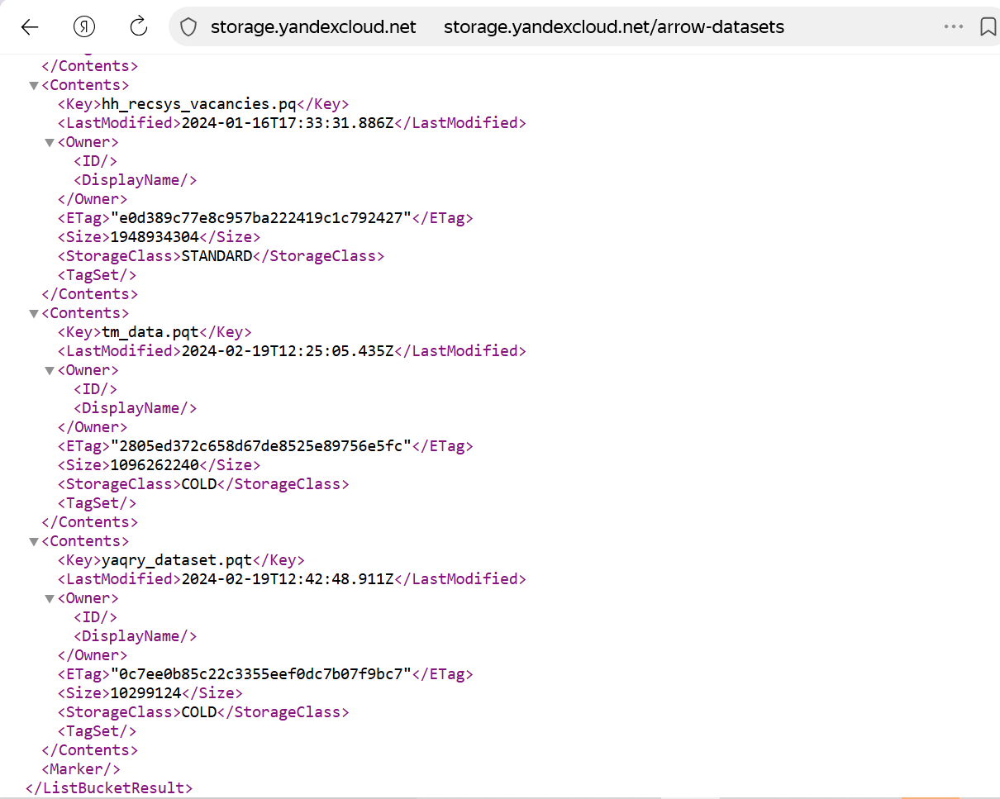
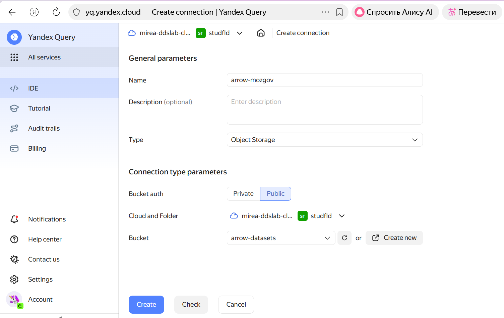
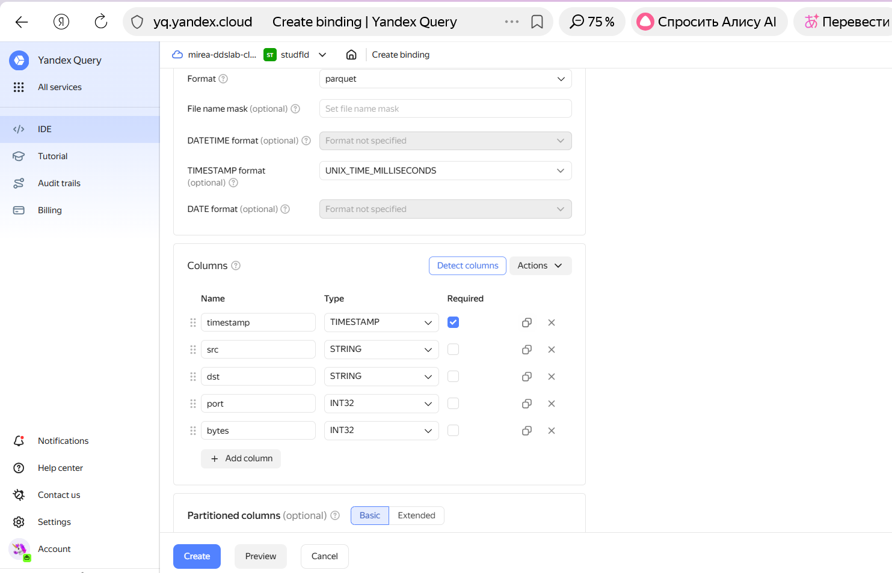
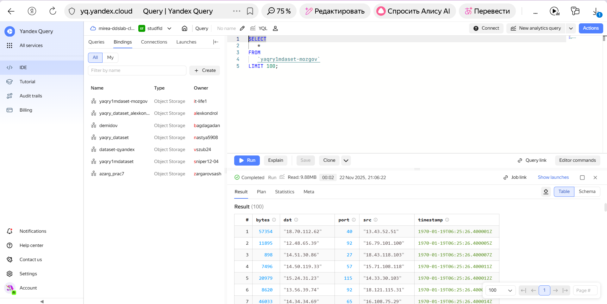
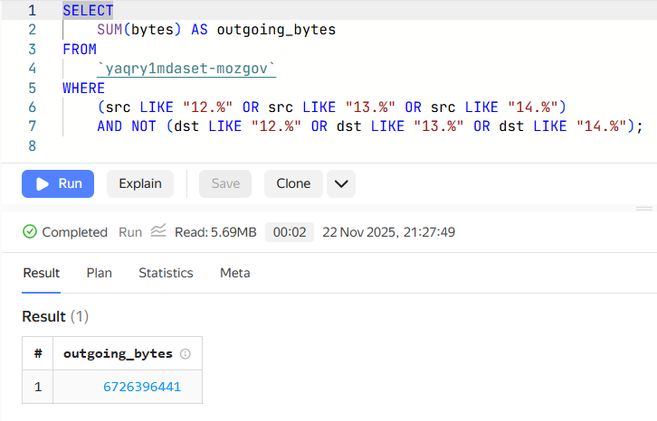
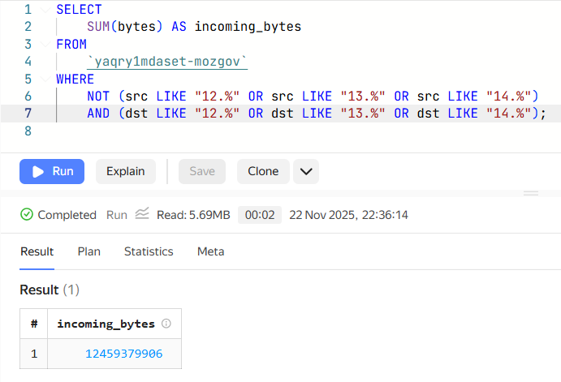

# Практическая работа 007
IT-life1@yandex.ru

# Использование технологии Yandex Query для анализа данных сетевой активности

## Цель работы

1.  Изучить возможности технологии Yandex Query для анализа
    структурированныхнаборов данных
2.  Получить навыки построения аналитического пайплайна для анализа
    данных спомощью сервисов Yandex Cloud
3.  Закрепить практические навыки использования SQL для анализа данных
    сетевойактивности в сегментированной корпоративной сети

## Исходные данные

1.  Операционная система: Windows 10
2.  Среда разработки: RStudio
3.  Версия интерпретатора R: 4.5.1

## Ход работы

1.  Проверить доступность данных в Yandex Object Storage.

2.  Подключить бакет как источник данных для Yandex Query

3.  Произвести анализ данных: 3.1 Известно, что IP адреса внутренней
    сети начинаются с октетов, принадлежащих интервалу \[12-14\].
    Определите количество хостов внутренней сети, представленных в
    датасете. 3.2 Определите суммарный объем исходящего трафика 3.3
    Определите суммарный объем входящего трафика

### Шаг 1

#### Проверим доступность данных в Yandex Object Storage

Для этого перейдем по ссылке
https://storage.yandexcloud.net/arrow-datasets и проверим существование
файла yaqry_dataset.pqt

### Шаг 2

#### Подключим бакет как источник данных для Yandex Query

Создадим соединение для бакета в S3 хранилище

Теперь, после создания соединения, укажем какой объект использовать
вкачестве источника данных. Для этого нужно сделать привязку данных.

Сделаем настройку привязки данных

Проверим сделанные ранние настройки

### Шаг 3

#### Произведем анализ данных

Известно, что IP адреса внутренней сети начинаются с октетов,
принадлежащих интервалу \[12-14\]. Определим количество хостов
внутренней сети, представленных в датасете

Определим суммарный объем исходящего трафика

Определим суммарный объем входящего трафика

