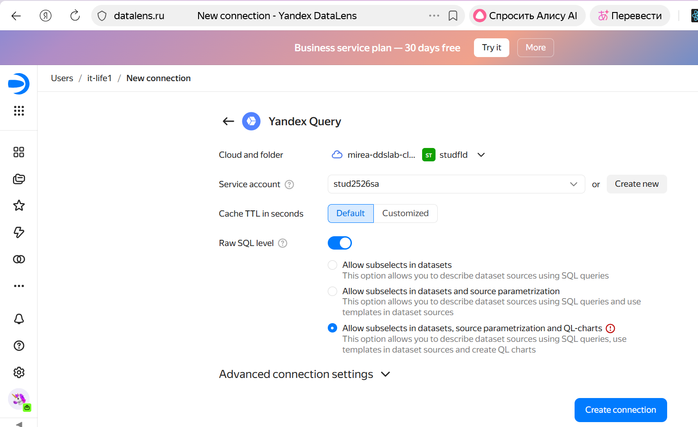
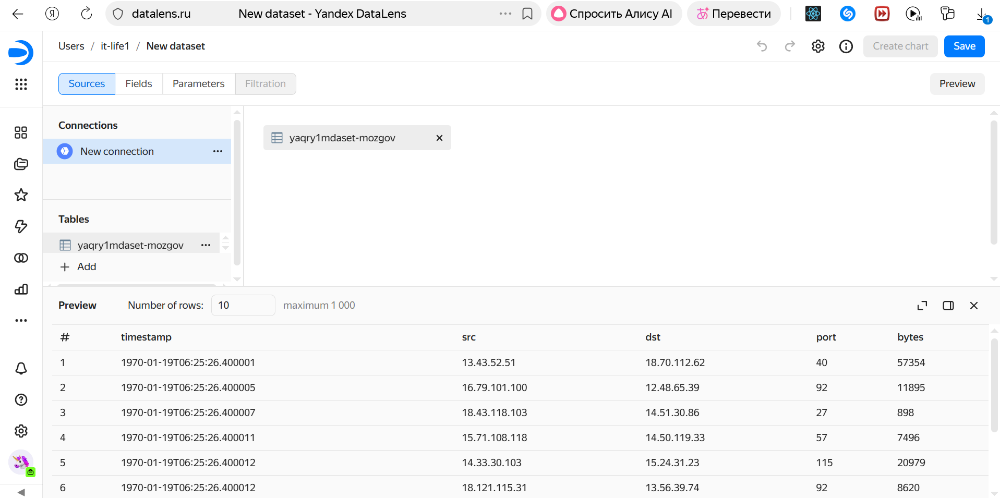
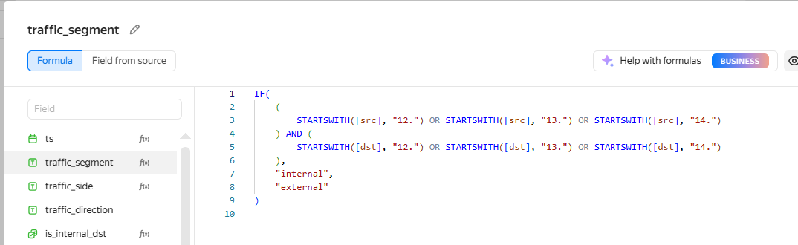
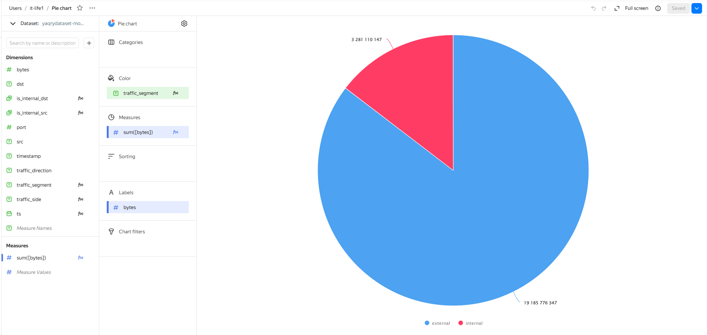
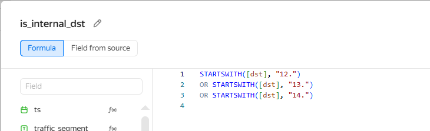
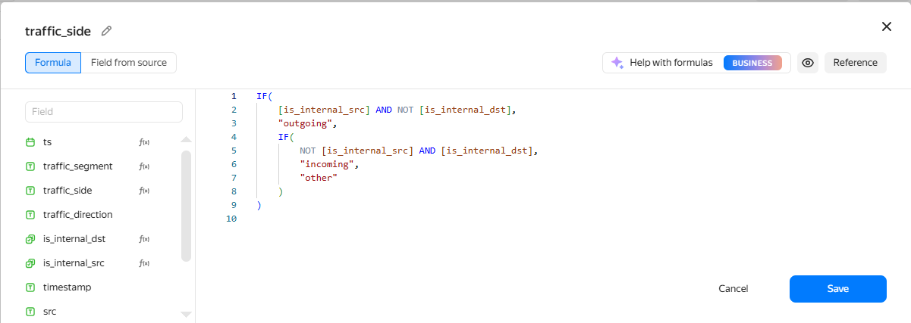
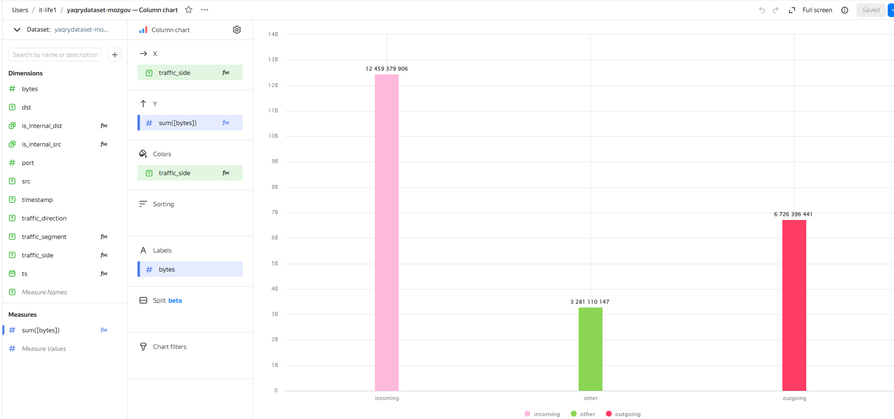
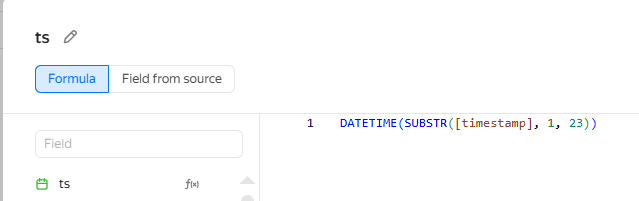
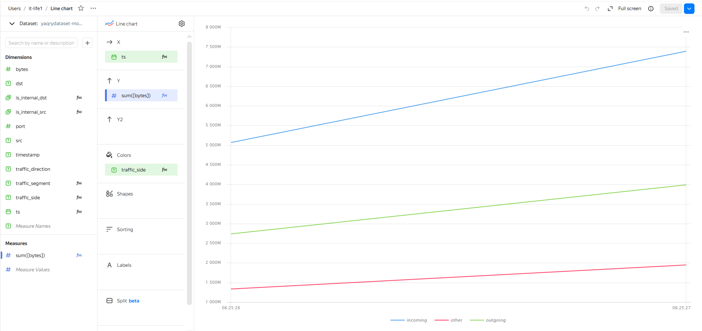
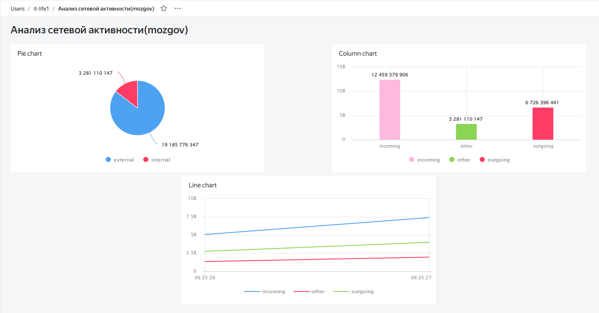

# Практическая работа 008

IT-life1\@yandex.ru

# Использование технологии Yandex DataLens для анализа данных сетевой активности

## Цель работы

1.  Изучить возможности технологии Yandex DataLens для визуального анализаструктурированных наборов данных
2.  Получить навыки визуализации данных для последующего анализа с помощьюсервисов Yandex Cloud
3.  Получить навыки создания решений мониторинга/SIEM на базе облачныхпродуктов и открытых программных решений
4.  Закрепить практические навыки использования SQL для анализа данных сетевойактивности в сегментированной корпоративной сети

## Исходные данные

1.  Операционная система: Windows 10
2.  Среда разработки: RStudio
3.  Версия интерпретатора R: 4.5.1

## Ход работы

1.  Настроить подключение к Yandex Query из DataLens

2.  Создать из запроса YandexQuery датасет DataLens

3.  Сделать нужные графики и диаграммы

4.  Составить дашборд

### Шаг 1

#### Настроим подключение к Yandex Query из DataLens

Для этого перейдем в соответствующий сервис – https://datalens.yandex.ru/

### Шаг 2

#### Создадим из запроса YandexQuery датасет DataLens

Перетащим из левой колонки результаты доступных запросов как датасет в правую часть экрвна. Внизу доступен предпросмотр датасета.

### Шаг 3

#### Сделаем нужные графики и диаграммы

##### Для начала выберем Pie Chart диаграмму и создадим свое поле traffic_segment со следующим правилом

Теперь создадим сам Pie Chart с кастомным полем

##### Создадим Column Chart и свои поля is_internal_src и is_internal_dst и traffic_side со следующими правилами

Поле is_internal_src:

Поле is_internal_dst:

Поле traffic_side:

Используя эти поля создадим сам Column Chart

##### Создадим Line Chart и свое поле ts со следующим правилом

Поле ts:

Используя эти поля создадим сам Line Chart

### Шаг 4

#### Создадим итоговый дашборд с нашими графиками

[Ссылка на итоговый дашборд](https://datalens.ru/3j6vwl776ro8o-analiz-setevoy-aktivnostimozgov)

